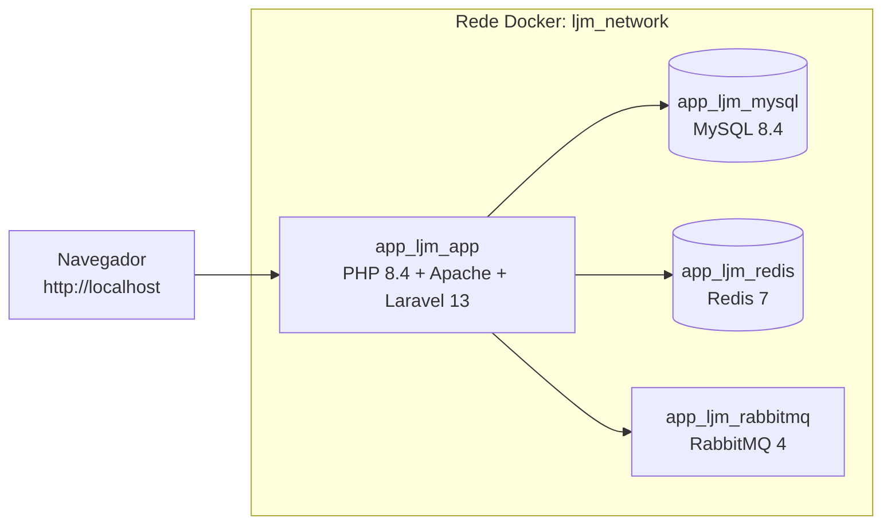

# app_ljm

**Sistema ERP para o cliente LJ Marcenaria**


Aplicação web em **PHP + Laravel** com arquitetura **MVC**, executada inteiramente em **containers Docker**. Para rodar o projeto, basta ter **Git** e **Docker** instalados: não é necessário instalar PHP, Composer, Node.js, MySQL, Redis ou RabbitMQ na sua máquina.

---

## Sumário

- [Tecnologias](#tecnologias)
- [Arquitetura](#arquitetura)
- [Status do projeto](#status-do-projeto)
- [Pré-requisitos](#pré-requisitos)
- [Instalação e execução](#instalação-e-execução)
- [Acessos](#acessos)
- [Uso diário](#uso-diário)
- [Comandos úteis](#comandos-úteis)
- [Estrutura do projeto](#estrutura-do-projeto)
- [Branches](#branches)
- [Solução de problemas](#solução-de-problemas)
- [Autor](#autor)

---

## Tecnologias

### Backend

| Tecnologia | Versão | Uso |
|---|---|---|
| PHP | 8.4 | Linguagem do backend (imagem oficial `php:8.4-apache`) |
| Laravel | 13 | Framework MVC |
| Apache | 2.4 | Servidor web, com `mod_rewrite` habilitado |
| Composer | 2 | Gerenciador de dependências PHP (executado dentro do container) |

### Dados e infraestrutura

| Tecnologia | Versão | Uso |
|---|---|---|
| MySQL | 8.4 | Banco de dados relacional |
| Redis | 7 (Alpine) | Cache e sessões (extensão `phpredis`) |
| RabbitMQ | 4 (com painel de administração) | Mensageria e filas |
| Docker / Docker Compose | — | Orquestração dos containers e da rede interna `ljm_network` |

### Frontend

| Tecnologia | Uso |
|---|---|
| HTML (views Blade) | Templates da aplicação |
| CSS com Bootstrap | Estilização e layout |
| JavaScript com jQuery | Interatividade |

### Ferramentas de desenvolvimento

| Ferramenta | Uso |
|---|---|
| Git e GitHub | Controle de versão e repositório remoto |
| Visual Studio Code | Editor de código e terminal integrado |
| MySQL Workbench (opcional) | Cliente gráfico para consultar o banco |

---

## Arquitetura

Todos os serviços rodam na rede Docker interna `ljm_network`. Apenas as portas necessárias são publicadas na máquina host.



### Serviços

| Serviço | Container | Imagem | Porta no host | Função |
|---|---|---|---|---|
| `app` | `app_ljm_app` | `app_ljm_app:dev` (build local do `Dockerfile`) | 80 | Aplicação Laravel servida pelo Apache |
| `mysql` | `app_ljm_mysql` | `mysql:8.4` | 3306 | Banco de dados |
| `redis` | `app_ljm_redis` | `redis:7-alpine` | 6379 | Cache e sessões |
| `rabbitmq` | `app_ljm_rabbitmq` | `rabbitmq:4-management` | 5672 (AMQP) e 15672 (painel) | Mensageria |

Os dados do MySQL, do Redis e do RabbitMQ ficam em volumes Docker nomeados (`app_ljm_mysql_data`, `app_ljm_redis_data` e `app_ljm_rabbitmq_data`) e persistem entre reinicializações.

### Padrão MVC

| Camada | Onde fica |
|---|---|
| **Model** | `app/Models/` |
| **View** | `resources/views/` (templates Blade) |
| **Controller** | `app/Http/Controllers/` |
| Rotas | `routes/web.php` |

---

## Status do projeto

Projeto em fase inicial de desenvolvimento.

| Item | Situação |
|---|---|
| Laravel 13 em PHP 8.4 com Apache, em container | Pronto |
| MySQL 8.4 conectado ao Laravel | Pronto |
| Redis para cache e sessões | Pronto |
| RabbitMQ (container e variáveis de ambiente) | Serviço provisionado; a integração de filas com o Laravel ainda não foi feita (`QUEUE_CONNECTION=database`) |
| Bootstrap e jQuery | Stack definida; integração prevista para as próximas etapas |

---

## Pré-requisitos

Instale apenas:

- [Git](https://git-scm.com/downloads)
- [Docker](https://docs.docker.com/get-docker/) com **Docker Compose v2** (já incluído no Docker Desktop)

Verifique a instalação:

```bash
git --version
docker --version
docker compose version
```

Portas livres na máquina: **80**, **3306**, **6379**, **5672** e **15672**. Se alguma estiver em uso, veja [Solução de problemas](#solução-de-problemas).

---

## Instalação e execução

Todos os comandos abaixo são executados no terminal, dentro da pasta do projeto. Os comandos do Laravel e do Composer rodam **dentro do container** `app`, por isso não é preciso ter PHP nem Composer instalados.

### 1. Clonar o repositório

```bash
git clone https://github.com/RegisSantos/app_ljm.git
cd app_ljm
```

A branch padrão é a `main`. Para a versão em desenvolvimento, use `git switch develop`.

### 2. Criar o arquivo de ambiente

```bash
cp .env.example .env
```

No Windows (PowerShell): `Copy-Item .env.example .env`

O `.env.example` já vem configurado para os containers (host do banco `mysql`, do Redis `redis` e do RabbitMQ `rabbitmq`). Não é preciso alterar nada para rodar localmente.

### 3. Construir e subir os containers

```bash
docker compose up -d --build
```

Na primeira execução, o Docker baixa as imagens e constrói a imagem da aplicação, o que pode levar alguns minutos. O comando termina quando o MySQL, o Redis e o RabbitMQ estão saudáveis.

Confira o estado dos serviços:

```bash
docker compose ps
```

Os quatro containers devem aparecer como `running`, e o `mysql`, o `redis` e o `rabbitmq` como `healthy`.

### 4. Instalar as dependências PHP

```bash
docker compose exec app composer install
```

### 5. Gerar a chave da aplicação

```bash
docker compose exec app php artisan key:generate
```

### 6. Criar as tabelas do banco de dados

```bash
docker compose exec app php artisan migrate
```

### 7. Acessar a aplicação

Abra **http://localhost** no navegador. A página inicial do Laravel deve ser exibida.

Para confirmar que o Laravel está conectado ao MySQL:

```bash
docker compose exec app php artisan db:show
```

> **Linux (Docker Engine):** se aparecer erro de permissão em `storage/` ou `bootstrap/cache/`, execute `chmod -R ugo+rwX storage bootstrap/cache` na pasta do projeto. Isso não costuma ser necessário no Docker Desktop.

---

## Acessos

| Recurso | Endereço | Usuário | Senha |
|---|---|---|---|
| Aplicação | http://localhost | — | — |
| Painel do RabbitMQ | http://localhost:15672 | `guest` | `guest` |
| MySQL | `127.0.0.1:3306`, banco `app_ljm` | `root` | `root` |
| Redis | `127.0.0.1:6379` | — | sem senha |

> Estas credenciais servem **somente para o ambiente local de desenvolvimento**. Nunca as utilize em um ambiente acessível pela internet.

Para consultar o banco com um cliente gráfico (por exemplo, o MySQL Workbench), crie uma conexão TCP/IP com host `127.0.0.1`, porta `3306`, usuário `root` e senha `root`. O Workbench pode exibir um aviso de versão não suportada com o MySQL 8.4; é possível continuar normalmente.

---

## Uso diário

Os containers **não iniciam automaticamente** com o computador nem com o Docker Desktop. Inicie e encerre o projeto quando for trabalhar:

```bash
# Iniciar
docker compose up -d

# Encerrar ao terminar (os dados são mantidos)
docker compose stop
```

---

## Comandos úteis

| Ação | Comando |
|---|---|
| Iniciar os containers | `docker compose up -d` |
| Reconstruir a imagem e iniciar | `docker compose up -d --build` |
| Parar os containers (mantém os dados) | `docker compose stop` |
| Remover containers e rede (mantém os volumes) | `docker compose down` |
| Remover containers, rede **e dados** deste projeto | `docker compose down -v` |
| Ver o estado dos serviços | `docker compose ps` |
| Acompanhar os logs da aplicação | `docker compose logs -f app` |
| Abrir um terminal dentro do container | `docker compose exec app bash` |
| Executar um comando do Artisan | `docker compose exec app php artisan <comando>` |
| Executar um comando do Composer | `docker compose exec app composer <comando>` |
| Rodar os testes | `docker compose exec app php artisan test` |
| Limpar os caches do Laravel | `docker compose exec app php artisan optimize:clear` |

> Atenção: `docker compose down -v` apaga os volumes deste projeto, incluindo todos os dados do banco de dados.

---

## Estrutura do projeto

```text
app_ljm/
├── app/
│   ├── Http/Controllers/    # Controllers (C)
│   ├── Models/              # Models (M)
│   └── Providers/
├── bootstrap/
├── config/                  # Configurações do Laravel
├── database/                # Migrations, factories e seeders
├── docker/
│   └── apache/
│       └── 000-default.conf # Virtual host do Apache (DocumentRoot em public/)
├── public/                  # Ponto de entrada (index.php)
├── resources/
│   ├── css/
│   ├── js/
│   └── views/               # Views Blade (V)
├── routes/
│   └── web.php              # Rotas web
├── storage/                 # Logs, cache e arquivos gerados
├── tests/                   # Testes automatizados
├── .env.example             # Modelo de variáveis de ambiente
├── Dockerfile               # Imagem da aplicação (PHP 8.4 + Apache)
├── docker-compose.yml       # Serviços, rede e volumes
└── README.md
```

---

## Branches

| Branch | Finalidade |
|---|---|
| `main` | Branch principal do projeto |
| `develop` | Branch de desenvolvimento, criada a partir da `main` |

---

## Solução de problemas

| Problema | Causa provável | Solução |
|---|---|---|
| `port is already allocated` ou `address already in use` ao subir | Outra aplicação usa uma das portas (80, 3306, 6379, 5672 ou 15672) | Encerre o outro serviço ou container, ou altere a porta do lado esquerdo em `ports:` no `docker-compose.yml` (por exemplo, `"8080:80"`) e ajuste o `APP_URL` no `.env` |
| Erro 500 ou `vendor/autoload.php` não encontrado | Dependências ainda não instaladas | `docker compose exec app composer install` |
| `No application encryption key has been specified` | Chave da aplicação não gerada | `docker compose exec app php artisan key:generate` |
| `Permission denied` em `storage/` ou `bootstrap/cache/` | Permissões da pasta no Linux | `chmod -R ugo+rwX storage bootstrap/cache` |
| MySQL demora a ficar `healthy` | Primeira inicialização do banco | Aguarde de 30 a 60 segundos e verifique com `docker compose logs mysql` |
| `Connection refused` ao rodar `artisan` fora do container | O host `mysql` só existe dentro da rede Docker | Execute sempre com `docker compose exec app php artisan ...` |
| A senha do MySQL foi alterada no `.env` e não funciona | O MySQL só lê a senha na primeira inicialização do volume | Se puder perder os dados, execute `docker compose down -v` e suba novamente |

---

## Autor

**Régis Santos** — [github.com/RegisSantos](https://github.com/RegisSantos)
